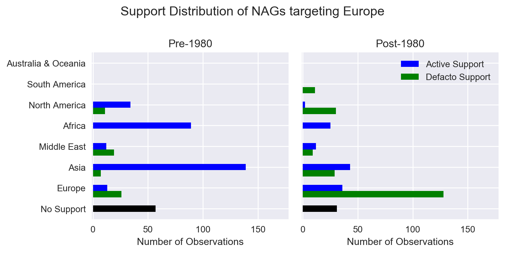

# Analysis of Terror Network.

## Summer Research Program 2018, Koc University, Istanbul, Turkey. 
I was selected for the Summer Research Program at KOC University, Istanbul, Turkey. My project <a href="https://nonstatearmedgroups.ku.edu.tr" target="_blank">Dangerous Companions</a> is an interdisciplinary initiative that focuses on non-state violence, especially the role of terrorism, the Middle East Conflict etc. 

Project is supplied by novel <a href="https://nonstatearmedgroups.ku.edu.tr" target="_blank"> NAG Dataset </a>. My task was focused on Data Visualization using directed graphs, analyzing yearly variations, cycles, and Hypothesis testing. NAG stands for Non-State Armed Groups (terrorists or revolutionaries).

## Evolution of NAG Identification.

Details: Visualizations/  
Visualizations: Dir consists of visualization of Dynamic Support->Target Terror Network from year 1945 - 2010.

## Insiders Treat

Details: Analysis-Insiders Treat/  
Analysis-Insiders Threat: Dir consists of analysis of patterns in pre 1980 and post 1980 support. 

Further, I am pursuing this project as my Major Project at Jaypee Institute of Information Technology under Social-Security domain. Details about problem statement and further implementation will be available by Dec 18 - Jan 19.
